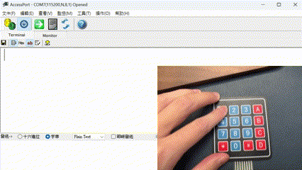
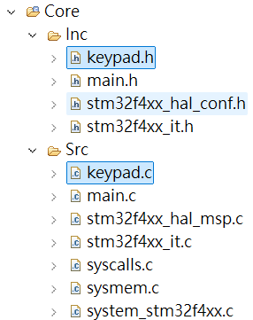
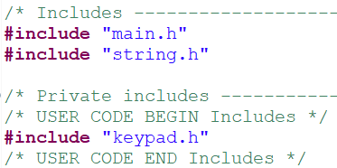
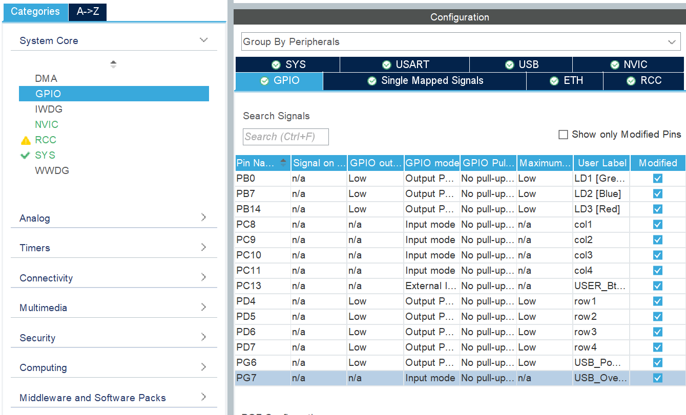
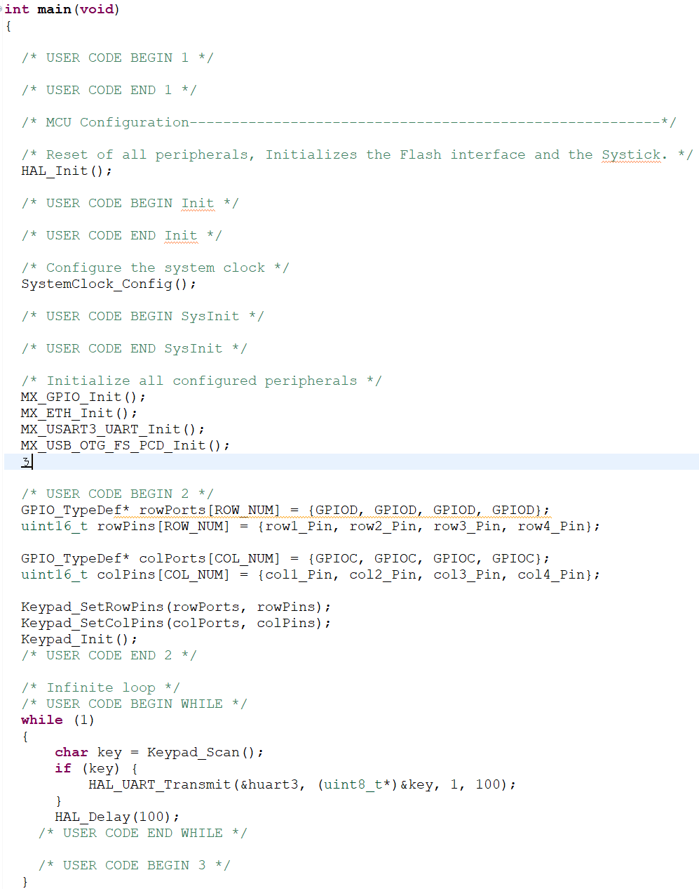

# STM32 Keypad Library

A simple, configurable 4x4 keypad driver library for STM32 microcontrollers using the HAL driver framework.



---

## Directory Structure

```
STM32_keypad/
├── src/        # Source files for keypad driver
│   ├── keypad.c
│   └── keypad.h
└── example/    # Basic usage example
    └── basic.c
```


## Setup Instructions

### 1. Add Driver to Your Project
Copy the files from `src/` into your STM32CubeIDE project. Ensure they are added under `Core/Src` and `Core/Inc` as shown below:



### 2. Include the Header File
In your main program, include `keypad.h`:

```c
#include "keypad.h"
```

Example:



### 3. Configure GPIO Pins
In your `main.c`, define the pins for rows and columns:

```c
GPIO_TypeDef* rowPorts[ROW_NUM] = {GPIOD, GPIOD, GPIOD, GPIOD};
uint16_t rowPins[ROW_NUM] = {row1_Pin, row2_Pin, row3_Pin, row4_Pin};

GPIO_TypeDef* colPorts[COL_NUM] = {GPIOC, GPIOC, GPIOC, GPIOC};
uint16_t colPins[COL_NUM] = {col1_Pin, col2_Pin, col3_Pin, col4_Pin};

Keypad_SetRowPins(rowPorts, rowPins);
Keypad_SetColPins(colPorts, colPins);
Keypad_Init();
```

> Pins must be configured as follows:
> - **Rows**: Output push-pull
> - **Columns**: Input with pull-up

You can configure GPIOs in STM32CubeMX:



### 4. Write the Main Loop

```c
while (1) {
    char key = Keypad_Scan();
    if (key) {
        HAL_UART_Transmit(&huart3, (uint8_t*)&key, 1, 100);
    }
    HAL_Delay(100);
}
```

Full example loop:



